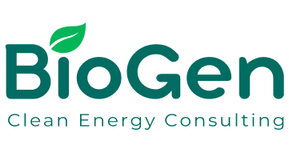
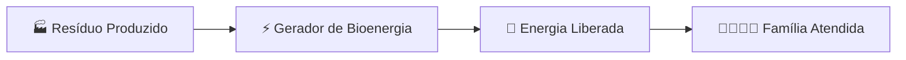
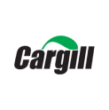

# 🌱 BioGen - Energia Limpa e Sustentável

<div align="center">
  
  
  [](https://github.com/biogen-team/projeto-biogen)
  [](https://nodejs.org/)
  [](https://angular.io/)
  [](https://sqlite.org/)
  
</div>

---

## 🎯 **Sobre o Projeto**

O **BioGen** é uma plataforma inovadora que transforma resíduos orgânicos em energia limpa e acessível através de biodigestores. Nossa missão é conectar grandes indústrias alimentícias, pecuárias e agrícolas com comunidades de baixa renda, criando um ciclo sustentável que beneficia tanto o meio ambiente quanto a sociedade.

### 🌍 **Impacto Social e Ambiental**

- 🏭 **+753** empresas cadastradas
- 👨‍👩‍👧‍👦 **+8.700** famílias atendidas
- ⚡ **8.773 MW** de energia gerada
- 🌿 **7.587 toneladas** de biomassa processada
- 🌱 Redução significativa de emissões de CO₂

---

## 🚀 **Como Funciona**

<div align="center">
  


</div>

### **Processo de Transformação:**

1. **📦 Coleta de Resíduos**: Indústrias alimentícias, pecuárias e agrícolas fornecem resíduos orgânicos
2. **🔄 Biodigestão**: Conversão dos resíduos em biogás através de biodigestores sustentáveis
3. **⚡ Geração de Energia**: Transformação do biogás em energia elétrica limpa
4. **🏠 Distribuição**: Fornecimento de energia acessível para comunidades de baixa renda

---

## 🎯 **Objetivos de Desenvolvimento Sustentável (ODS)**

<div align="center">
  <table>
    <tr>
      <td align="center">
        
        <br><strong>ODS 7</strong><br>Energia Limpa<br>e Acessível
      </td>
      <td align="center">
        
        <br><strong>ODS 10</strong><br>Redução das<br>Desigualdades
      </td>
      <td align="center">
        
        <br><strong>ODS 12</strong><br>Consumo e Produção<br>Responsáveis
      </td>
      <td align="center">
        
        <br><strong>ODS 13</strong><br>Ação contra a<br>Mudança do Clima
      </td>
    </tr>
  </table>
</div>

---

## 🛠️ **Tecnologias Utilizadas**

### **Frontend**
- **Angular 18** - Framework principal
- **TypeScript** - Linguagem de programação
- **Bootstrap 5** - Framework CSS responsivo
- **Chart.js** - Visualização de dados
- **RxJS** - Programação reativa

### **Backend**
- **Node.js** - Runtime JavaScript
- **Express.js** - Framework web
- **SQLite** - Banco de dados
- **JWT** - Autenticação
- **bcrypt** - Criptografia de senhas
- **Joi** - Validação de dados

### **Ferramentas de Desenvolvimento**
- **Angular CLI** - Ferramenta de linha de comando
- **Nodemon** - Monitoramento automático
- **Git** - Controle de versão

### **Documentação**
- **Swagger** - Documentação interativa da API

---

## 🚀 **Como Rodar o Projeto**

### **1. Clone o repositório**
```bash
git clone https://github.com/biogen-team/projeto-biogen-2025.git
cd projeto-biogen-2025
```

### **2. Backend**
```bash
cd backend
npm install
cp .env.example .env # Edite as variáveis se necessário
npm run init-db # Inicializa o banco e dados de exemplo
npm run dev # ou npm start
```
- Acesse a documentação da API: [http://localhost:3008/api-docs](http://localhost:3008/api-docs)

### **3. Frontend**
```bash
cd ../Projeto-BioGen-main
npm install
npm run dev # ou npm start
```
- Acesse o app: [http://localhost:4200](http://localhost:4200)

---

## 📚 **Swagger - Documentação Interativa da API**
- Acesse: [http://localhost:3008/api-docs](http://localhost:3008/api-docs)
- Faça login pela rota `/api/auth/login` e use o botão **Authorize** para testar rotas protegidas.
- Todas as rotas principais estão documentadas com exemplos.

---

## 👤 **Acessos de Teste**
- **Admin:** `admin@biogen.com` / `admin123`
- **Fornecedor:** `fornecedor@exemplo.com` / `fornecedor123`

---

## 📝 **Principais Funcionalidades**
- Cadastro e login de usuários (admin, fornecedor, beneficiário)
- Dashboard com gráficos modernos e relatórios em PDF
- Gestão de lançamentos (criar, editar, excluir)
- Documentação Swagger completa

---

## 🌟 **Funcionalidades Principais**

### **Para Fornecedores (Empresas)**
- ✅ Cadastro completo com CNPJ
- 📊 Dashboard com métricas de produção
- 📈 Controle de biomassa processada
- 💰 Cálculo de benefícios fiscais
- 📋 Relatórios mensais detalhados

### **Para Beneficiários (Famílias)**
- 🏠 Cadastro via NIS (Número de Identificação Social)
- 🎯 Acesso a energia limpa e acessível

### **Para Administradores**
- 👥 Gestão completa de usuários
- 📊 Dashboard administrativo

---

## 🤝 **Nossa Equipe**

<div align="center">
  <table>
    <tr>
      <td align="center">
        
        <br><strong>Alessandro Rodrigues</strong>
        <br><em>CEO & Founder</em>
        <br>Visão estratégica e liderança
      </td>
      <td align="center">
        
        <br><strong>Daniel Adeljarbas</strong>
        <br><em>Diretor de Tecnologia</em>
        <br>Arquitetura e desenvolvimento
      </td>
      <td align="center">
        
        <br><strong>Raphael Cremer</strong>
        <br><em>DBA</em>
        <br>Manutenção, Otimização e Segurança
      </td>
      <td align="center">
        
        <br><strong>Taise Rodrigues</strong>
        <br><em>Diretora de Marketing</em>
        <br>Estratégia e comunicação
      </td>
      <td align="center">
        
        <br><strong>Thiago Muniz</strong>
        <br><em>Diretor Financeiro</em>
        <br>Gestão financeira e planejamento
      </td>
    </tr>
  </table>
</div>

---

## 🤝 **Empresas Parceiras**

<div align="center">
  <table>
    <tr>
      <td align="center">
        
        <br><strong>BRF S.A.</strong>
      </td>
      <td align="center">
        
        <br><strong>Bunge</strong>
      </td>
      <td align="center">
        
        <br><strong>Ambev</strong>
      </td>
      <td align="center">
        
        <br><strong>Cargill</strong>
      </td>
    </tr>
  </table>
</div>

---

## 📊 **API Endpoints**

### **Autenticação**
```http
POST /api/auth/login              # Login de usuários
POST /api/auth/register/fornecedor # Cadastro de fornecedores
POST /api/auth/register/beneficiario # Cadastro de beneficiários
PUT  /api/auth/reset-password/:id   # Redefinir senha de usuário
```

### **Lançamentos**
```http
GET    /api/users                 # Listar todos os usuários
GET    /api/users/:id             # Buscar usuário por ID
PUT    /api/users/:id             # Atualizar usuário
DELETE /api/users/:id             # Excluir usuário
```

### **Lançamentos**
```http
GET    /api/lancamentos           # Listar lançamentos
POST   /api/lancamentos           # Criar lançamento
PUT    /api/lancamentos/:id       # Atualizar lançamento
DELETE /api/lancamentos/:id       # Excluir lançamento
```

### **Health Check**
```http
GET /api/health                    # Status da API
GET /api-docs                      # Documentação Swagger
```

---

## 🎨 **Screenshots**

<div align="center">
  <table>
    <tr>
      <td align="center">
        
        <br><strong>Página Inicial</strong>
      </td>
      <td align="center">
        
        <br><strong>Dashboard Fornecedor</strong>
      </td>
      <td align="center">
        
        <br><strong>Dashboard Administrador</strong>
      </td>
    </tr>
  </table>
</div>

---

## 📈 **Roadmap**

- [x] **Fase 1**: MVP com funcionalidades básicas
- [x] **Fase 2**: Sistema de autenticação e autorização
- [x] **Fase 3**: Dashboard interativo
- [ ] **Fase 5**: Integração com IoT para monitoramento em tempo real
- [ ] **Fase 6**: Machine Learning para otimização de processos
- [ ] **Fase 7**: Expansão internacional

---

## 🤝 **Como Contribuir**

1. **Fork** o projeto
2. Crie uma **branch** para sua feature (`git checkout -b feature/AmazingFeature`)
3. **Commit** suas mudanças (`git commit -m 'Add some AmazingFeature'`)
4. **Push** para a branch (`git push origin feature/AmazingFeature`)
5. Abra um **Pull Request**

### **Diretrizes de Contribuição**
- Seguir padrões de código TypeScript/JavaScript
- Escrever testes para novas funcionalidades
- Documentar mudanças significativas
- Manter commit messages claros e descritivos

---


<div align="center">

### 🌱 **"Mudando o mundo com energia limpa"** 🌱

**Construindo um futuro mais sustentável e equitativo para todos.**

⭐ **Se você gostou do projeto, não esqueça de dar uma estrela!** ⭐

</div>

---

## 🛠️ **Principais Mudanças Recentes**
- Integração completa com Swagger (documentação e testes interativos)
- Refatoração de controllers, services e rotas
- Novos gráficos e exportação de relatórios em PDF
- Melhorias de segurança e validação
